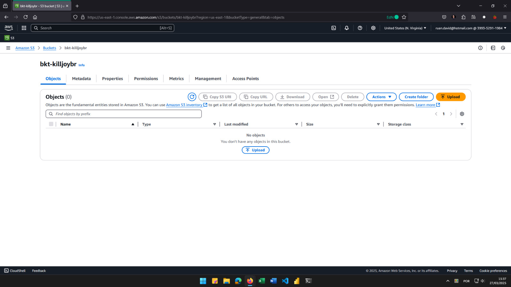

# Laboratórios-EscolaDaNuvem-AWS-Solutions-Architecht

## Evidências

### CRIAÇÃO DO BUCKET

---

### UPLOAD NO BUCKET

---

### CRIAÇÃO DO USUARIO DE ANALISTA

---

### CONTA DE ANALISTA

#### VISUALIZAÇÃO DENTRO DO BUCKET

---

#### LISTAGEM DOS BUCKETS

---

#### DEMONSTRAÇÃO DE REGRA DE SEGURANÇA - EC2

---

#### DEMONSTRAÇÃO DE REGRA DE SEGURANÇA - DELETAR CONTEUDO DO BUCKET

